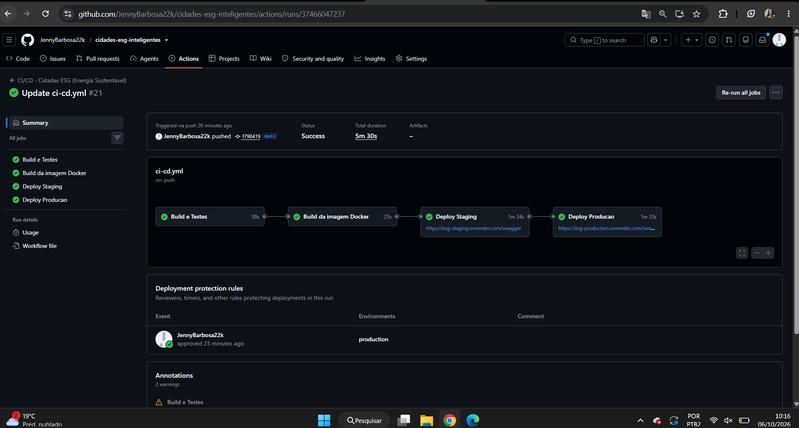
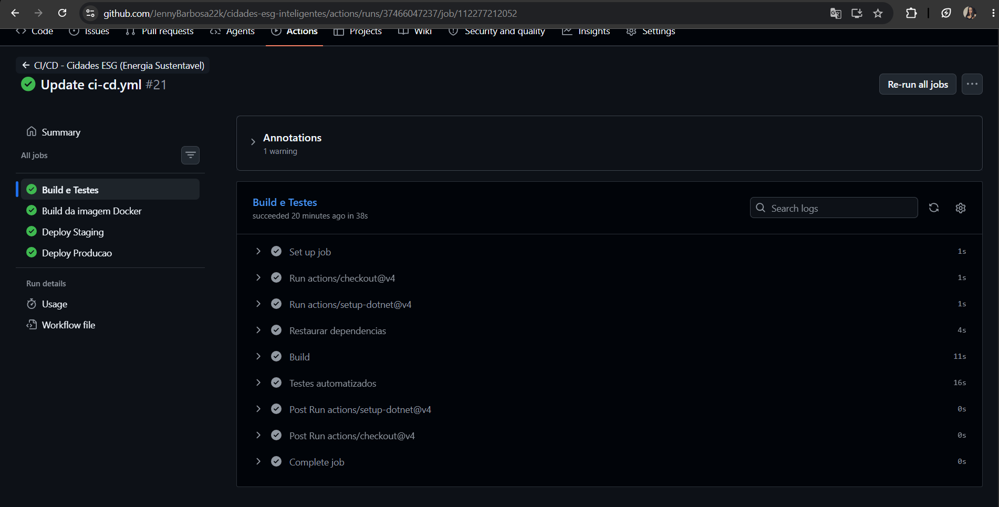
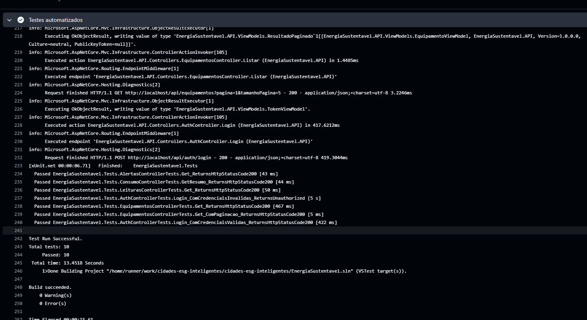
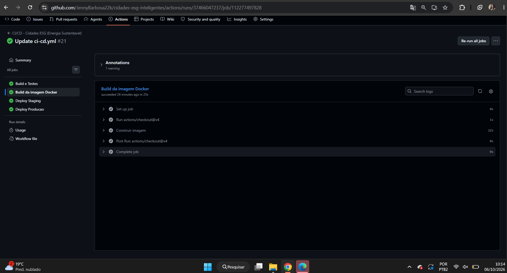
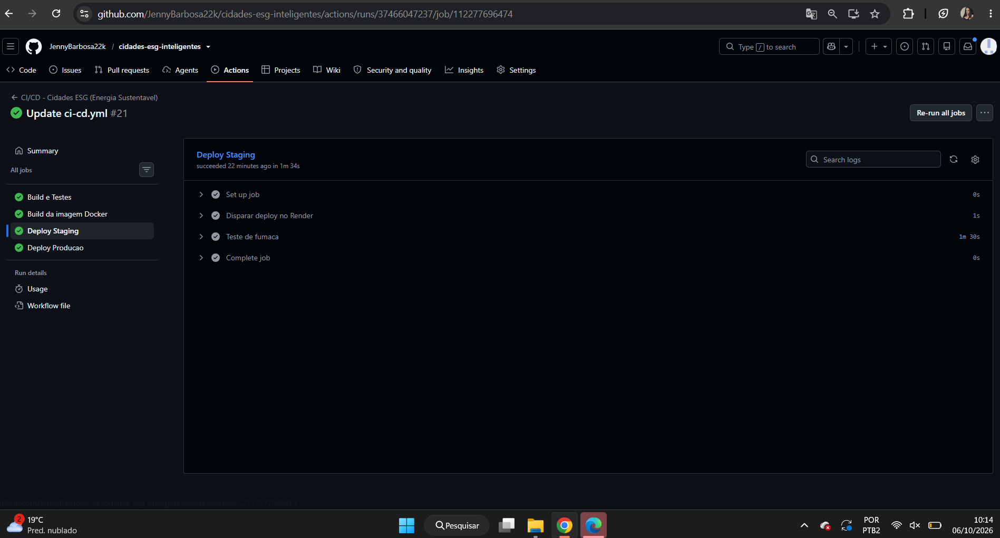
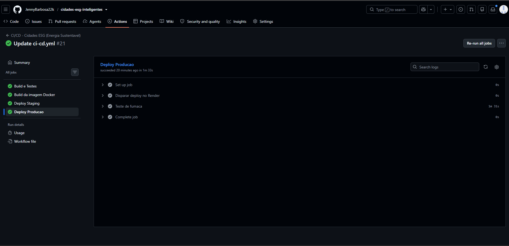
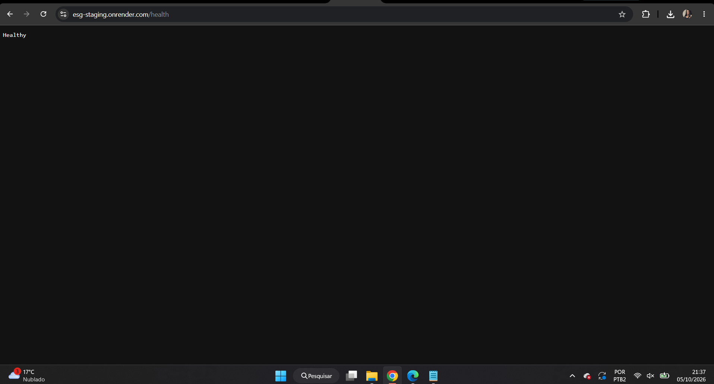
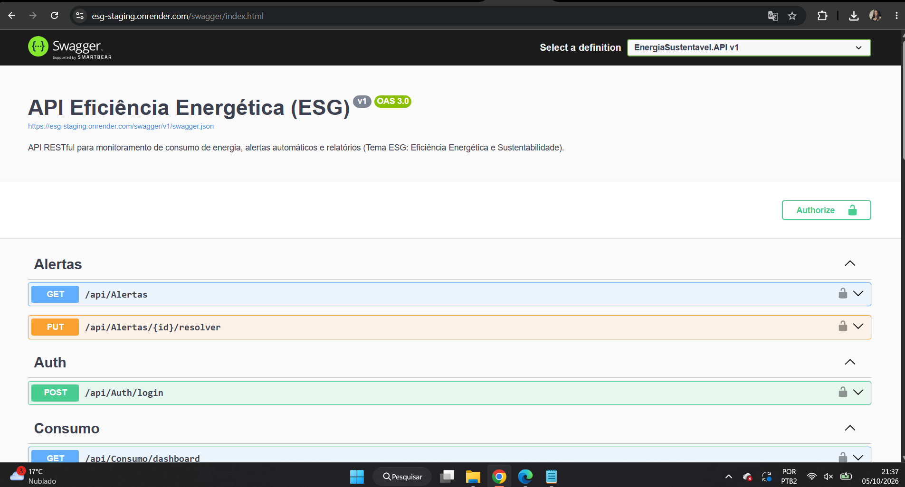
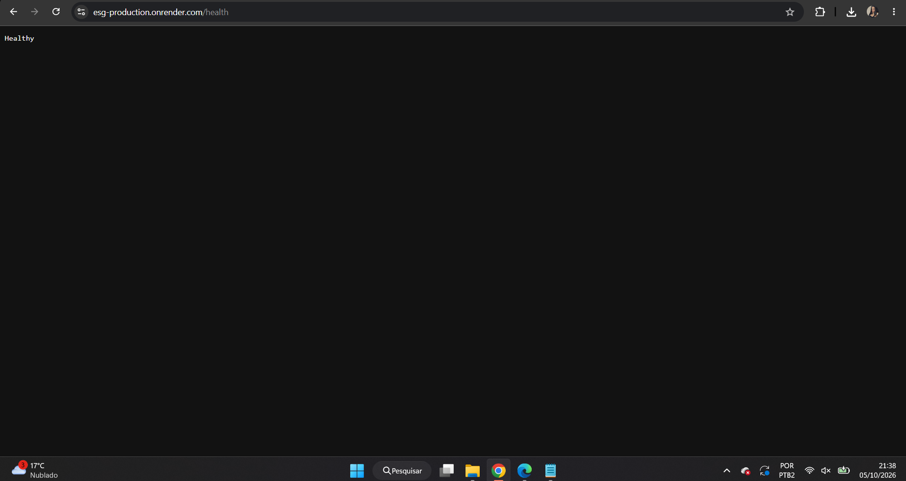
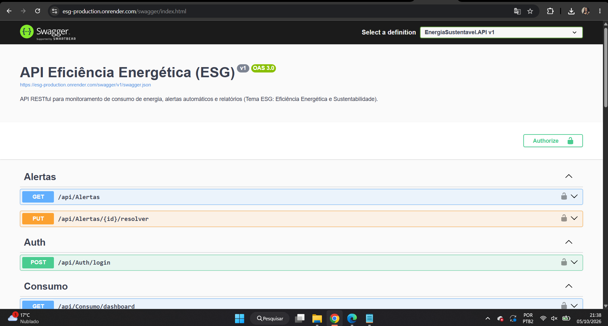

# Projeto - Cidades ESGInteligentes

**API Eficiência Energética e Sustentabilidade (ESG)** — API RESTful em **C# / .NET 8** para monitoramento do consumo de energia,
geração automática de alertas quando o consumo ultrapassa o limite de um equipamento (estilo IoT) e relatórios analíticos de consumo.
Pipeline CI/CD com GitHub Actions, containerização com Docker e deploy automatizado em **staging** e **produção**.

> Tema ESG: eficiência energética e sustentabilidade (pilar Ambiental).

**Integrantes:**

| Nome | RM |
|---|---|
| Arthur Wylliam Santos Brandão | RM562519 |
| Carlos Antonio Campos Machado | RM562904 |
| Jennyfer Barbosa de Souza | RM565354 |
| Nargila Soares Mota | RM562956 |
| Pedro Felippe Colaço De Biazi | RM553309 |

**Repositório:** https://github.com/JennyBarbosa22k/cidades-esg-inteligentes

**Ambientes:**
- Staging: https://esg-staging.onrender.com/swagger
- Produção: https://esg-production.onrender.com/swagger

> Os apps estão no plano gratuito do Render e "dormem" quando ficam sem acesso: a primeira requisição pode levar cerca de 1 minuto.

## Como executar localmente com Docker

Pré-requisitos: Docker e Docker Compose.

```bash
git clone https://github.com/JennyBarbosa22k/cidades-esg-inteligentes.git
cd cidades-esg-inteligentes
cp .env.example .env          # ajuste a senha do banco e a chave JWT
docker compose up -d --build  # sobe API + PostgreSQL
```

Acesse o Swagger em **http://localhost:8080/swagger** e o health check em **http://localhost:8080/health**.
Na primeira execução as tabelas são criadas automaticamente e populadas com dados de exemplo.

Para derrubar: `docker compose down` (com `-v` apaga também o volume do banco).

### Autenticação

Endpoints de escrita exigem token JWT. Usuário de exemplo (seed): `admin@energia.com` / `Admin@123`.
Faça `POST /api/auth/login`, copie o `token` e use o botão **Authorize** do Swagger.

### Endpoints

| Recurso | Rotas principais |
|---|---|
| Auth | `POST /api/auth/login` |
| Equipamentos | `GET/POST /api/equipamentos`, `GET/PUT/DELETE /api/equipamentos/{id}` |
| Leituras | `GET/POST /api/leituras` (gera alerta automático ao exceder o limite), `GET /api/leituras/{id}` |
| Alertas | `GET /api/alertas`, `PUT /api/alertas/{id}/resolver` |
| Consumo (analítico) | `GET /api/consumo/dashboard`, `GET /api/consumo/resumo`, `GET /api/consumo/equipamento/{id}` |
| Saúde | `GET /health` |

Listagens possuem paginação (`pagina`, `tamanhoPagina`). Uma coleção do Postman está em `postman/`.

### Testes

```bash
dotnet test
```

Cada controller possui testes xUnit de integração (`WebApplicationFactory<Program>` com banco InMemory).

## Pipeline CI/CD

**Ferramentas:** GitHub Actions (`.github/workflows/ci-cd.yml`) para o pipeline e Render como plataforma de hospedagem
dos ambientes de staging e produção (deploy disparado por *Deploy Hook*).

| Etapa (job) | O que faz | Quando roda |
|---|---|---|
| Build e Testes | `dotnet restore`, `dotnet build` e `dotnet test` (testes xUnit de todos os controllers) | push e pull request na `main` |
| Build da imagem Docker | Constrói a imagem a partir do `Dockerfile`, validando a containerização | após build e testes |
| Deploy Staging | Aciona o Deploy Hook do Render e faz teste de fumaça em `/health` | push na `main`, após a imagem |
| Deploy Produção | Mesmo processo, **com aprovação manual** (environment `production` com *Required reviewers*) | após staging OK |

Se qualquer etapa falhar, as seguintes não executam. O deploy de produção só acontece depois do staging validado e aprovado.

**Configuração:** environments `staging` e `production` no GitHub, cada um com o secret `RENDER_DEPLOY_HOOK`
(URL do deploy hook do respectivo serviço no Render).

**Variáveis de ambiente nos serviços do Render:**

| Variável | Descrição |
|---|---|
| `ConnectionStrings__DefaultConnection` | Conexão com o PostgreSQL (`Host=...;Database=...;Username=...;Password=...;Search Path=<schema>`) |
| `Database__Schema` | Schema do ambiente (`staging` ou `producao`), criado automaticamente |
| `Jwt__Key` | Chave de assinatura do JWT |
| `ASPNETCORE_ENVIRONMENT` | `Production` |
| `ASPNETCORE_URLS` | `http://+:10000` |

Como o plano gratuito do Render permite apenas um banco PostgreSQL, staging e produção compartilham a mesma instância,
isolados em **schemas diferentes**.

## Containerização

**Dockerfile** (multi-stage):

```dockerfile
# ---------- Estagio 1: build ----------
FROM mcr.microsoft.com/dotnet/sdk:8.0 AS build
WORKDIR /src

# Restaura dependencias primeiro (aproveita cache de camadas)
COPY src/EnergiaSustentavel.API/EnergiaSustentavel.API.csproj src/EnergiaSustentavel.API/
RUN dotnet restore src/EnergiaSustentavel.API/EnergiaSustentavel.API.csproj

# Copia o codigo e publica em Release
COPY src/ src/
RUN dotnet publish src/EnergiaSustentavel.API/EnergiaSustentavel.API.csproj \
    -c Release -o /app/publish /p:UseAppHost=false

# ---------- Estagio 2: runtime (imagem enxuta) ----------
FROM mcr.microsoft.com/dotnet/aspnet:8.0 AS final
WORKDIR /app
ENV ASPNETCORE_URLS=http://+:8080
EXPOSE 8080
COPY --from=build /app/publish .
USER app
ENTRYPOINT ["dotnet", "EnergiaSustentavel.API.dll"]
```

Estratégias adotadas:

- **Multi-stage build**: o SDK do .NET fica só no estágio de build; a imagem final usa apenas o runtime ASP.NET (menor e mais segura).
- **Cache de dependências**: o `.csproj` é copiado e restaurado antes do restante do código.
- **Usuário não-root** (`USER app`) e porta configurada por `ASPNETCORE_URLS`.
- **docker-compose.yml** (uso local): serviços `api` + `db` (PostgreSQL 16), **volume** `pgdata` (persistência),
  **rede** `energia-net`, **variáveis de ambiente** via `.env` e `depends_on` com `service_healthy`
  para a API só subir depois que o banco estiver pronto.
- Em staging/produção o Render constrói a imagem a partir do mesmo `Dockerfile` e injeta as variáveis de ambiente. O job "Build da imagem Docker" do pipeline valida que o `Dockerfile` constrói antes de qualquer deploy.

## Prints do funcionamento

### Pipeline (GitHub Actions)













### Staging (https://esg-staging.onrender.com)





### Produção (https://esg-production.onrender.com)





## Tecnologias utilizadas

C# / .NET 8 (ASP.NET Core Web API), Entity Framework Core 8, PostgreSQL 16 (Npgsql), JWT, BCrypt, Swagger/Swashbuckle,
xUnit + WebApplicationFactory (testes), Docker, Docker Compose, GitHub Actions, Render, Postman.

## Checklist de entrega

| Item | OK |
|---|---|
| Projeto compactado em .ZIP com estrutura organizada | ☑ |
| Dockerfile funcional | ☑ |
| docker-compose.yml ou arquivos Kubernetes | ☑ |
| Pipeline com etapas de build, teste e deploy | ☑ |
| README.md com instruções e prints | ☑ |
| Documentação técnica com evidências (PDF ou PPT) | ☑ |
| Deploy realizado nos ambientes staging e produção | ☑ |

Documentação técnica completa (PDF): `docs/Documentacao-Cidades-ESG-DevOps.pdf`.
